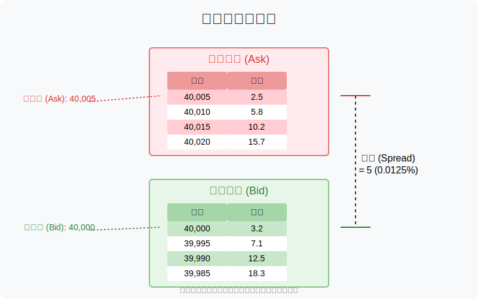
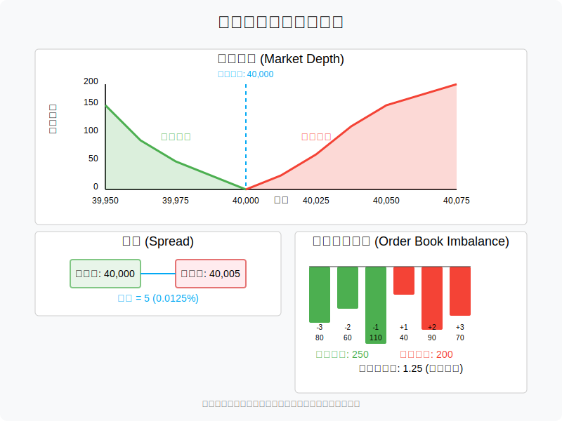
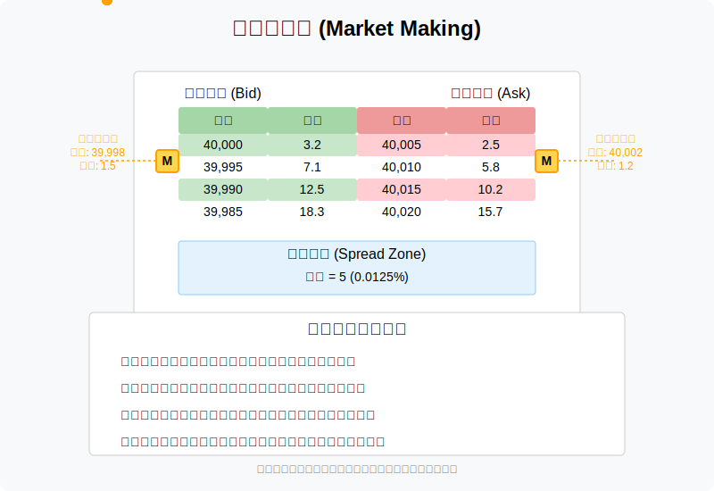
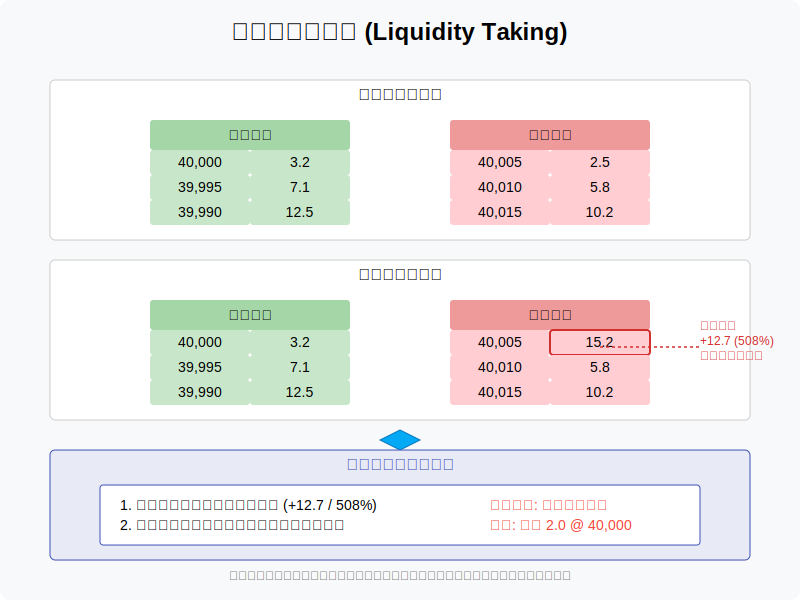
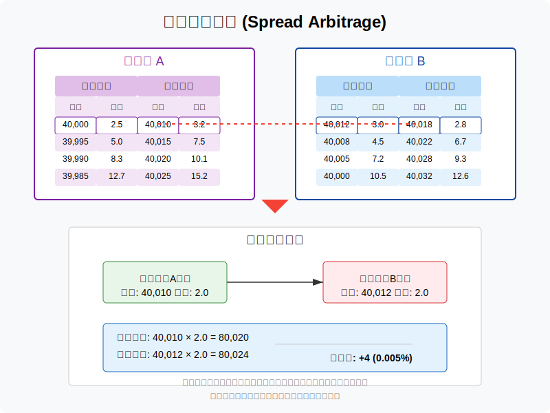
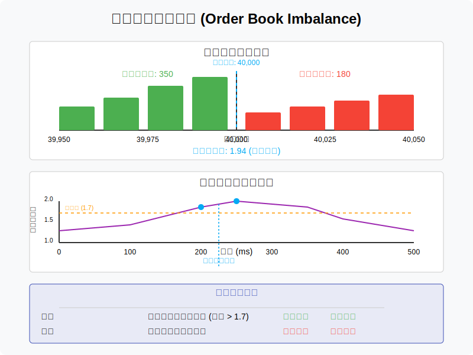
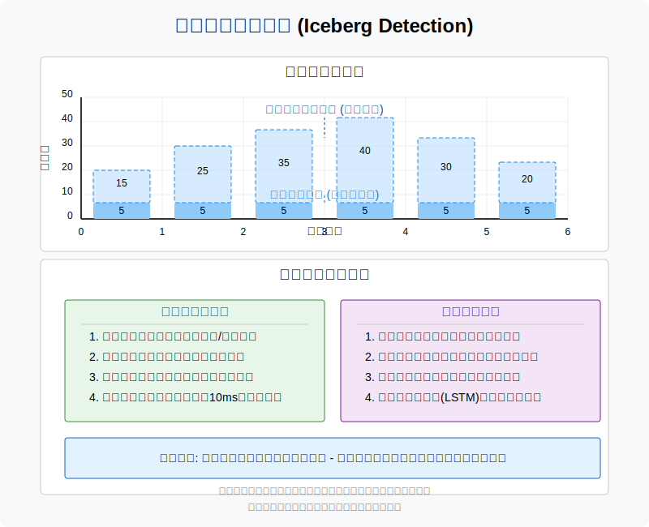
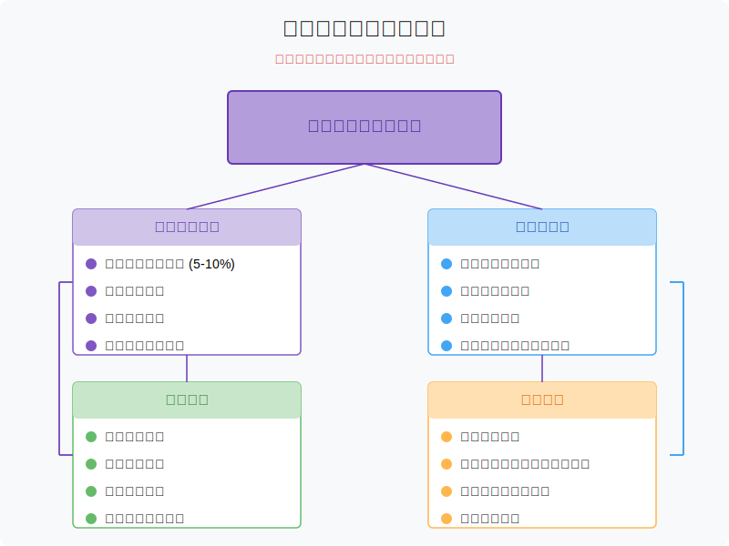

# 盘口报价（Order Book）交易策略原型

本文档展示了基于盘口报价（Order Book）的各种交易策略原型图。这些策略通常用于高频交易（HFT）、做市商（Market Making）或套利场景，核心在于分析买卖双方的挂单量、价格分布和流动性变化。

## 目录

1. [盘口数据的基本结构](#盘口数据的基本结构)
2. [核心指标可视化](#核心指标可视化)
3. [做市商策略（Market Making）](#做市商策略)
4. [流动性捕捉（Liquidity Taking）](#流动性捕捉)
5. [价差套利（Spread Arbitrage）](#价差套利)
6. [订单簿不平衡策略](#订单簿不平衡策略)
7. [冰山订单探测（Iceberg Detection）](#冰山订单探测)
8. [风险管理框架](#风险管理框架)

## 盘口数据的基本结构

订单簿（Order Book）是交易所中买卖双方挂单的实时快照，包含以下关键信息：
- 买一价（Bid）和卖一价（Ask）：即最优买卖报价
- 挂单量（Depth）：各价位上的未成交订单数量
- 价差（Spread）：卖一价与买一价的差值

## 核心指标可视化

盘口交易的核心指标包括：
- 价差（Spread）：反映市场流动性
- 市场深度（Market Depth）：订单簿中不同价位的累积挂单量
- 不平衡（Imbalance）：某一价位的买卖挂单量差异

## 做市商策略

做市商策略通过在买一和卖一之间挂单赚取价差收益：
- 在买一价上方挂卖单，卖一价下方挂买单
- 动态调整报价以应对市场波动
- 实施库存管理控制持仓风险

## 流动性捕捉

监测订单簿中的大单或隐藏流动性，在流动性被消耗前抢先成交：
- 监控卖一/买一价挂单量的突然变化
- 探测"隐藏流动性"消失后的价格跳空机会

## 价差套利

利用同一资产在不同交易所或不同合约间的价差进行套利：
- 监测跨市场盘口价差
- 当价差超过交易成本时快速下单
- 需要极低延迟和快速撤单能力

## 订单簿不平衡策略

当买一和卖一的挂单量出现显著不平衡时，预测短期价格方向：
- 买一挂单量远大于卖一：可能预示价格上涨压力
- 卖一挂单量远大于买一：可能预示价格下跌压力
- 配合大单撤单信号增强预测准确性

## 冰山订单探测

通过订单簿模式识别隐藏的大单（冰山订单）：
- 分析挂单量的时间序列变化
- 寻找重复出现的固定数量撤单/挂单模式
- 利用机器学习模型识别异常订单流

## 风险管理框架

盘口策略的风险管理关键点：
- 设置单笔成交比例限制
- 监控市场冲击成本（Slippage）
- 应对极端行情下订单簿流动性枯竭的情况
- 监控策略盈亏平衡点 