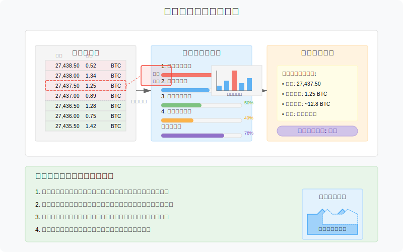
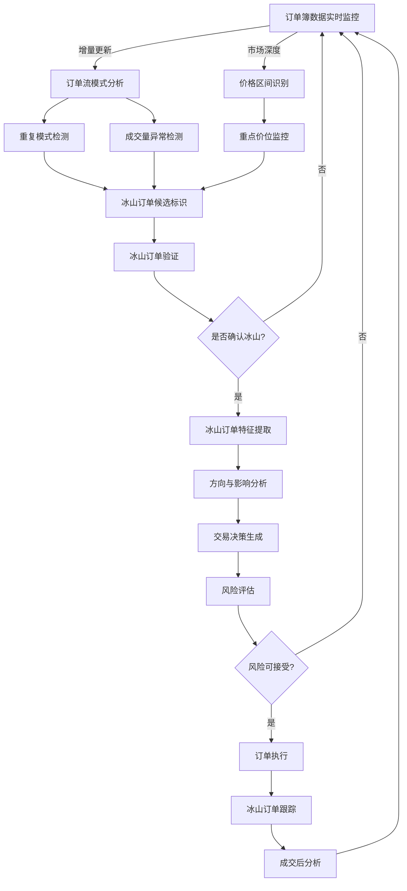
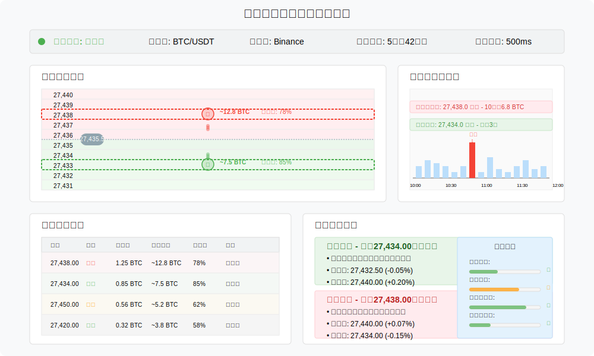
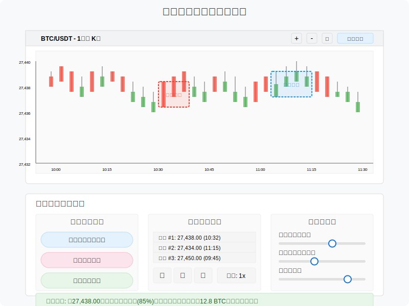

# 冰山订单探测策略（Iceberg Detection）原型设计

冰山订单探测策略通过识别隐藏在订单簿中的大体量订单（冰山订单），预测价格走势并从中获利。本文档描述该策略的业务流程和界面原型。

## 策略概述

冰山订单是大型交易者为减少市场冲击而采用的隐藏订单形式，仅显示总量的一小部分。冰山订单探测策略通过分析订单流模式和成交量异常，识别这类隐藏订单，并根据其位置和方向预测价格走势。

## 业务流程

冰山订单探测策略的核心业务流程如下：

## 冰山订单探测方法

冰山订单探测策略使用多种方法来识别隐藏订单：

1. **重复补充模式检测**
   - 跟踪特定价位的挂单量反复被成交后又快速补充的模式
   - 分析补充量的一致性和周期性
   - 识别固定数量批次的成交模式

2. **时间-成交量异常分析**
   - 监测特定价位的成交量是否显著高于预期
   - 分析成交量的时间分布和密度
   - 识别成交量分布的异常集中

3. **订单簿深度不连续性**
   - 分析订单簿深度曲线上的"台阶"或不连续点
   - 识别价格压力带和支撑带
   - 监测深度突然变化的价位

4. **价格反弹模式识别**
   - 分析价格触及特定水平后的反弹行为
   - 监测多次尝试突破但失败的价位
   - 衡量反弹强度与频率的关系

## 策略参数配置界面

策略配置参数包括：

| 参数名称 | 描述 | 默认值 | 范围 |
|---------|------|-------|------|
| 模式重复阈值 | 识别重复模式的最小次数 | 3次 | 2 - 10次 |
| 补充时间窗口 | 监测订单补充的最大时间窗口 | 2秒 | 0.5 - 10秒 |
| 最小批次量 | 被识别为冰山批次的最小交易量 | 1 BTC | 0.1 - 50 BTC |
| 成交量异常阈值 | 触发异常警报的标准差倍数 | 2.5 | 1.5 - 5 |
| 价格区间宽度 | 监测冰山订单的价格区间百分比 | 0.5% | 0.1% - 2% |
| 方向确认周期 | 确认冰山订单方向的观察周期 | 5分钟 | 1 - 30分钟 |
| 最小置信度 | 执行交易的最小冰山确认度 | 75% | 60% - 95% |
| 跟踪时长 | 发现冰山后的最大跟踪时间 | 1小时 | 10分钟 - 12小时 |

## 监控面板原型

监控面板包含以下关键区域：

### 1. 冰山订单雷达
- 价格热图上的冰山订单标记
- 冰山订单大小与确信度可视化
- 历史冰山位置追踪
- 价格行为与冰山关系分析

### 2. 订单流异常监测
- 实时订单流模式分析
- 成交量异常高亮显示
- 补充模式可视化
- 异常模式历史比较

### 3. 当前活跃冰山
- 已识别冰山订单列表
- 冰山特征和状态
- 剩余体量估计
- 影响范围预测

### 4. 交易信号面板
- 基于冰山的交易信号
- 信号强度和可靠性指标
- 建议进场与出场点
- 风险评估指标

## 冰山订单类型与特征

冰山订单探测策略区分多种冰山订单类型：

1. **防御型冰山**
   - 位于关键支撑或阻力位
   - 目的是防止价格突破特定水平
   - 特征：价格接近时活跃性增加

2. **吸筹/出货型冰山**
   - 长时间存在于特定价位
   - 目的是大量买入/卖出而不抬高/压低价格
   - 特征：固定数量批次补充

3. **狩猎型冰山**
   - 通常位于流动性集中区
   - 目的是触发止损单或清算
   - 特征：快速部署和显著的价格冲击

4. **伪装型冰山**
   - 故意在多个价位分散
   - 目的是隐藏真实意图
   - 特征：多个小型冰山协同行动

## 交互式探测工具

交互式探测工具功能：

1. **手动标记模式**
   - 允许交易员标记疑似冰山区域
   - 系统提供验证反馈
   - 人机协同提高探测准确率

2. **历史回放分析**
   - 回放已确认冰山的行为
   - 提取共同特征
   - 增强算法学习能力

3. **灵敏度调节**
   - 动态调整探测参数
   - 适应不同市场条件
   - 平衡误报与漏报率

4. **多维可视化**
   - 时间-价格-成交量三维视图
   - 订单流动态重建
   - 模式相似性比较

## 技术实现考虑

冰山订单探测策略的技术实现需要关注：

1. **高性能数据处理**
   - 处理超高频订单数据
   - 实时模式匹配算法
   - 基于GPU的并行计算

2. **机器学习增强**
   - 使用监督学习识别典型模式
   - 异常检测算法
   - 时间序列预测模型

3. **自适应阈值调整**
   - 根据市场波动性动态调整参数
   - 时段适应性优化
   - 多周期自校准

4. **分布式监测系统**
   - 多交易对并行监测
   - 相关资产协同分析
   - 资源动态分配 