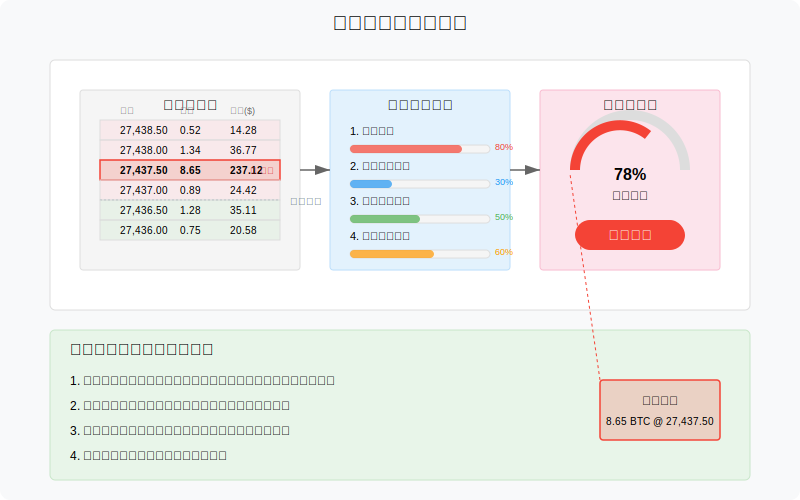
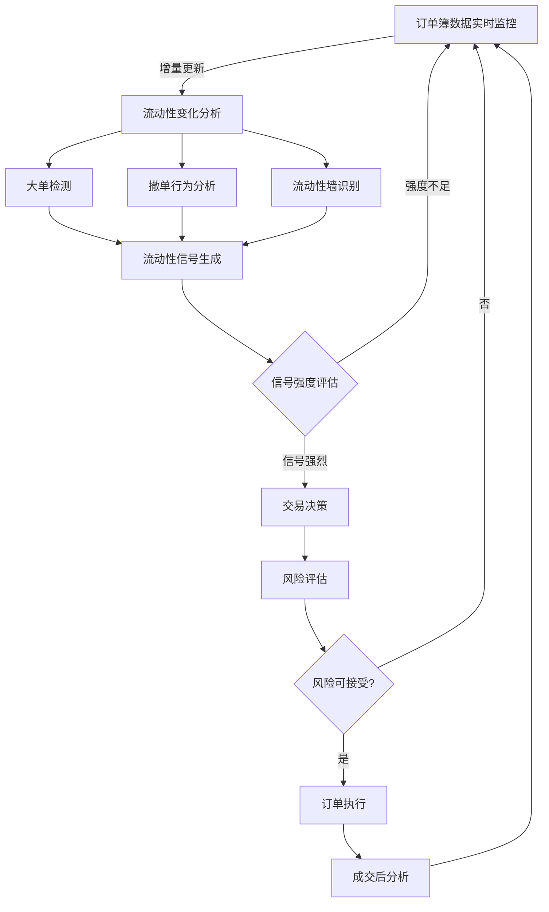
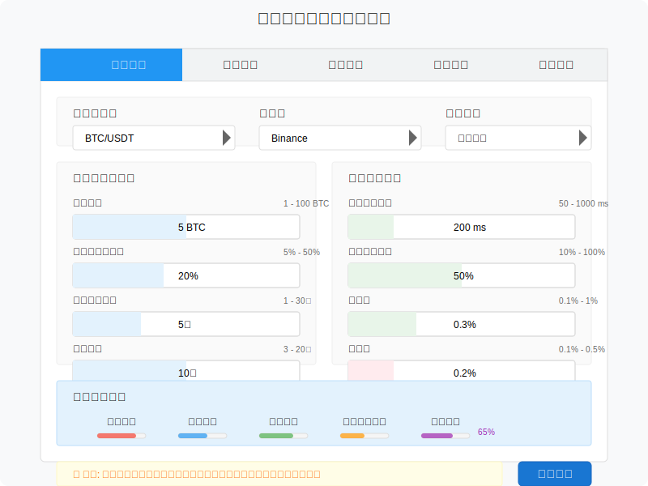
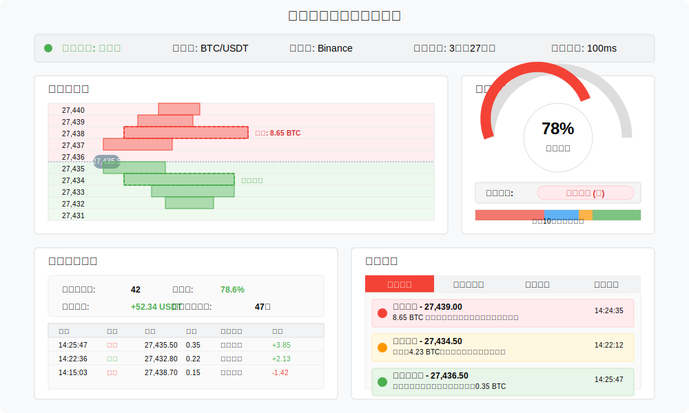
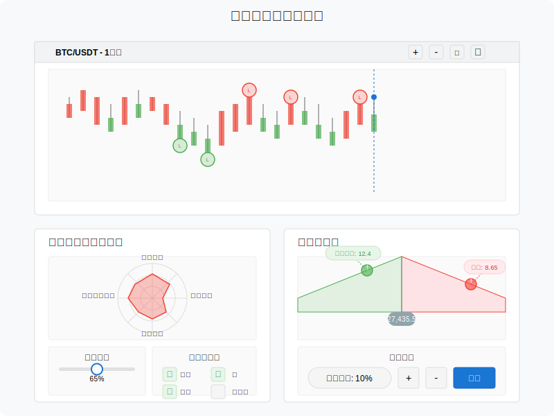

# 流动性捕捉策略（Liquidity Taking）原型设计

流动性捕捉策略通过监测订单簿中的大单或冰山订单，在流动性被消耗前抢先成交。本文档描述该策略的业务流程和界面原型。

## 策略概述

流动性捕捉策略的核心是识别订单簿中的显著流动性变化，预测价格短期波动，并在变化发生前抢先下单。该策略通常作为交易者的主动型工具，而非被动做市。

## 业务流程

流动性捕捉策略的核心业务流程如下：

## 策略参数配置界面

策略配置参数包括：

| 参数名称 | 描述 | 默认值 | 范围 |
|---------|------|------|------|
| 大单阈值 | 定义何为"大单"的交易量 | 5 BTC | 1 - 100 BTC |
| 流动性变化阈值 | 触发信号的最小流动性变化百分比 | 20% | 5% - 50% |
| 撤单监测窗口 | 监测撤单行为的时间窗口 | 5秒 | 1 - 30秒 |
| 信号响应延迟 | 从信号生成到下单的最大延迟 | 200ms | 50 - 1000ms |
| 跟踪深度 | 监测订单簿的深度级别 | 10档 | 3 - 20档 |
| 交易数量比例 | 相对于触发信号的交易量比例 | 50% | 10% - 100% |
| 止盈点 | 获利回吐点设置 | 0.3% | 0.1% - 1% |
| 止损点 | 止损设置 | 0.2% | 0.1% - 0.5% |

## 监控面板原型

监控面板包含以下关键区域：

### 1. 流动性热图
- 订单簿深度可视化
- 大单位置高亮显示
- 流动性变化实时标记
- 价格热区指示

### 2. 信号监控面板
- 当前活跃信号强度
- 最近信号历史记录
- 信号类型分布
- 预测准确率统计

### 3. 交易执行区
- 最近执行的交易
- 持仓情况
- 盈亏统计
- 平均持仓时间

### 4. 异常流动性警报
- 大单突发预警
- 流动性突变预警
- 重要价位突破预警
- 市场流动性枯竭预警

## 特殊信号类型

流动性捕捉策略识别的几种关键信号类型：

1. **大单压力信号**
   - 单一价位上突然出现大量挂单
   - 短时间内多个小单在同一价位累积
   
2. **撤单行为信号**
   - 重要支撑/阻力位大量撤单
   - 连续价位区间内快速撤单
   
3. **流动性墙信号**
   - 特定价位区间出现显著高于周围的挂单量
   - 流动性墙突然消失
   
4. **流动性不平衡信号**
   - 买卖双方流动性分布严重不均
   - 某一方向流动性快速枯竭

## 前端交互设计

交互设计重点：

1. **实时流动性变化高亮**
   - 使用动态颜色渐变表示流动性增减
   - 大单通过闪烁或特殊边框标记
   
2. **信号强度可视化**
   - 信号强度计量表
   - 多维信号指标雷达图
   
3. **交易机会标记**
   - 在价格图表上标记潜在交易机会
   - 信号触发点与成交点可视化对比
   
4. **自定义警报设置**
   - 用户可自定义流动性阈值
   - 多级别警报系统

## 技术实现考虑

流动性捕捉策略的技术实现需要注意：

1. **超低延迟要求**
   - 微秒级数据处理能力
   - 专用网络连接降低延迟
   
2. **大数据处理**
   - 订单簿完整历史数据存储
   - 实时增量数据处理
   
3. **机器学习增强**
   - 使用机器学习识别复杂流动性模式
   - 自适应参数调整
   
4. **风控集成**
   - 每笔交易风险评估
   - 异常市场条件自动暂停 