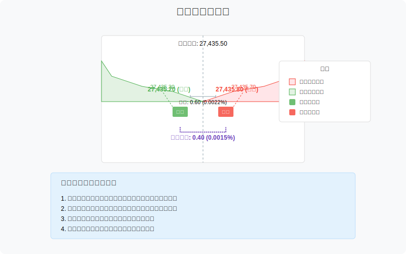
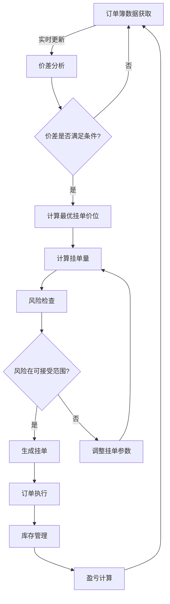
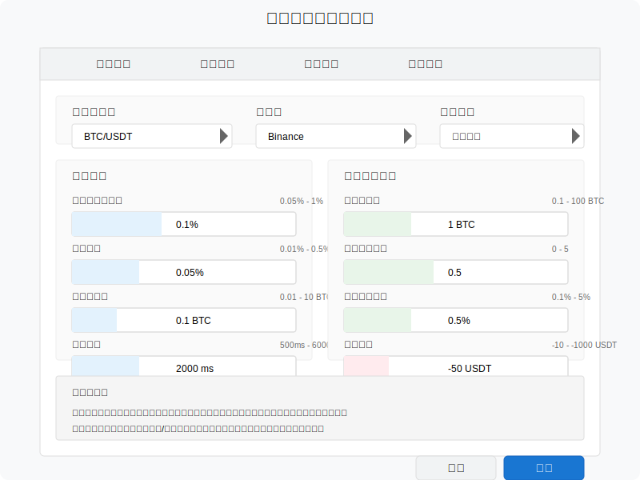
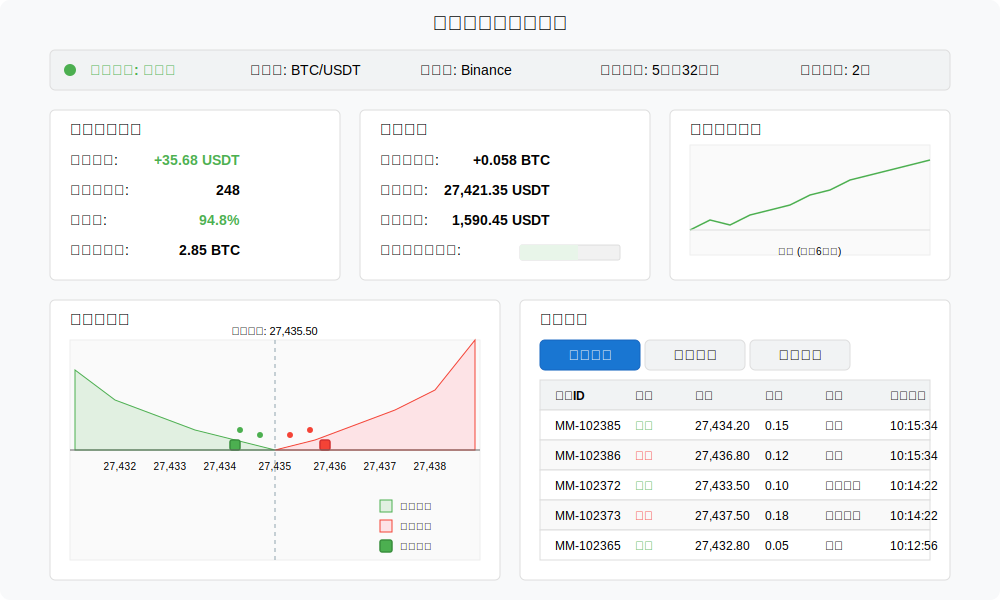
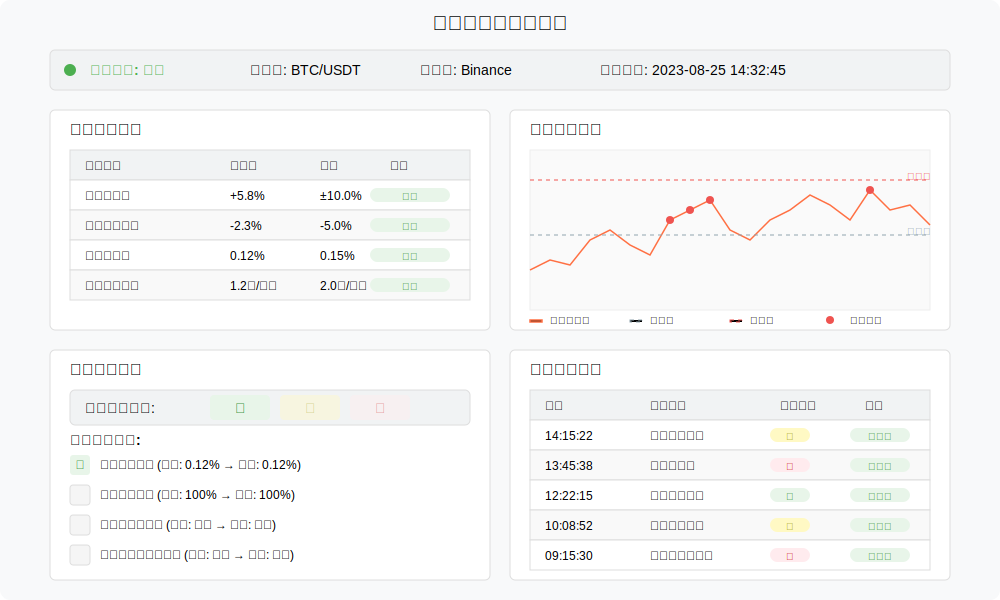

# 做市商策略（Market Making）原型设计

做市商策略通过在买卖价差之间提供流动性，从价差收益中获利。本文档描述该策略的业务流程和界面原型。

## 策略概述

做市商策略通过在买一价之上挂买单、卖一价之下挂卖单来获取价差收益，同时需要动态调整报价以管理风险。

## 业务流程

做市商策略的核心业务流程如下：

## 策略参数配置界面

策略配置参数包括：

| 参数名称 | 描述 | 默认值 | 范围 |
|---------|------|------|------|
| 目标价差百分比 | 挂单之间的目标价差 | 0.1% | 0.05% - 1% |
| 挂单深度 | 距离买一/卖一价格的距离 | 0.05% | 0.01% - 0.5% |
| 单笔挂单量 | 每个订单的数量 | 0.1 BTC | 0.01 - 10 BTC |
| 最大持仓量 | 允许的最大单向持仓 | 1 BTC | 0.1 - 100 BTC |
| 库存偏移系数 | 库存不平衡时的价格调整系数 | 0.5 | 0 - 5 |
| 更新频率 | 订单更新的时间间隔 | 2000ms | 500ms - 60000ms |
| 价格滑动保护 | 价格大幅波动时暂停交易的阈值 | 0.5% | 0.1% - 5% |

## 监控面板原型

监控面板包含以下关键区域：

### 1. 策略状态概览
- 运行状态（激活/暂停/停止）
- 运行时长
- 当前盈亏
- 总交易次数
- 成功率

### 2. 库存管理面板
- 当前净持仓
- 买入/卖出持仓明细
- 持仓成本
- 持仓市值
- 库存不平衡指标

### 3. 挂单可视化
- 当前活跃挂单位置
- 挂单与市场深度对比
- 历史成交点位

### 4. 实时盈亏图表
- 累计盈亏曲线
- 单笔交易盈亏分布
- 每小时/每日盈亏统计

## 风险管理功能

风险管理模块包括：

1. **库存管理控制**
   - 自动调整买卖报价以平衡库存
   - 库存超限警报和自动减仓
   
2. **波动性防护**
   - 波动率超阈值自动暂停
   - 大单吃单预警系统
   
3. **流动性监控**
   - 市场深度异常检测
   - 买卖挂单不平衡预警

4. **止损控制**
   - 单笔交易止损
   - 总体策略止损
   - 日内亏损限制

## 技术实现考虑

做市商策略的实现需要关注以下技术点：

1. **低延迟架构**
   - 使用内存计算减少交易延迟
   - 订单簿增量更新而非全量获取
   
2. **精确时间同步**
   - 毫秒级订单时间戳处理
   - 交易所时间同步机制

3. **异常处理机制**
   - 断连自动恢复
   - 订单状态不一致处理
   - 部分成交订单管理 