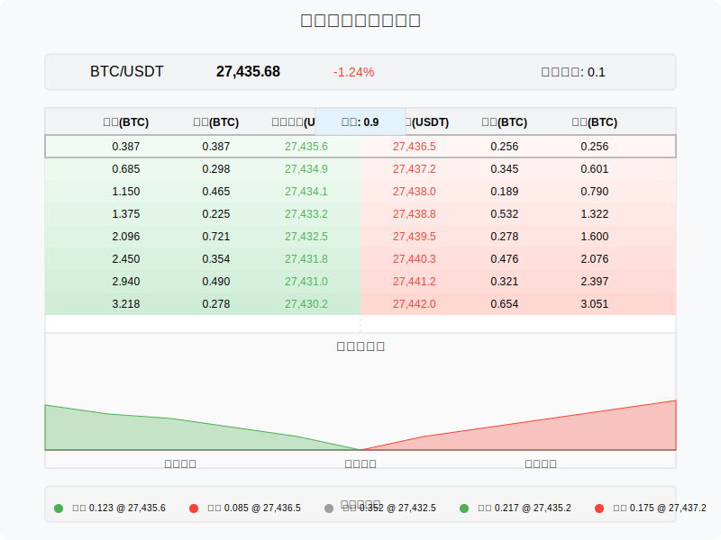
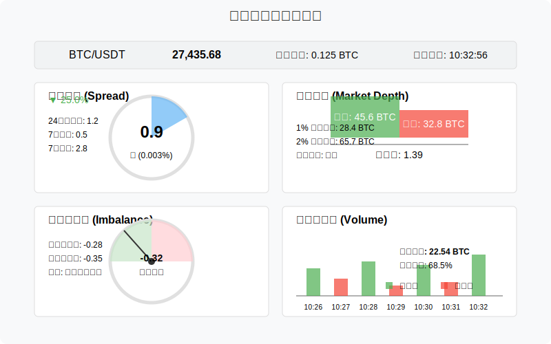
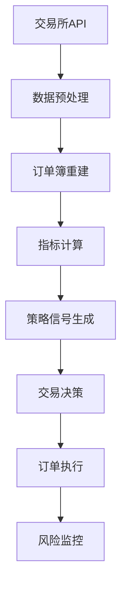

# 盘口策略核心要素原型设计

本文档描述盘口交易策略的核心要素和数据结构，为所有策略模块提供基础。

## 订单簿数据结构原型



订单簿数据结构将包含以下关键元素：
- 买单区域（Bid）和卖单区域（Ask）
- 各价位的挂单量（Depth）
- 价格深度可视化
- 实时订单流（Order Flow）显示

## 关键指标面板原型



关键指标面板将实时展示：
- 当前价差（Spread）
- 市场深度（Market Depth）
- 买卖不平衡指标（Imbalance）
- 成交量分析

## 数据流原型

订单簿数据流程图如下：



## 前端组件设计

### 订单簿深度图组件

```typescript
interface OrderBookDepthProps {
  bids: [price: number, volume: number][];  // 买单数据
  asks: [price: number, volume: number][];  // 卖单数据
  depth: number;                           // 显示深度级别
  currentPrice: number;                    // 当前成交价
  aggregationLevel: number;                // 价格聚合级别
}
```

深度图组件将提供以下交互功能：
- 缩放调整显示深度
- 悬停查看具体价格和挂单量
- 调整价格聚合级别
- 高亮显示重要价位

### 订单流显示组件

```typescript
interface OrderFlowProps {
  recentOrders: {
    price: number;
    volume: number;
    side: 'buy' | 'sell';
    timestamp: number;
    type: 'limit' | 'market' | 'cancel';
  }[];
  timeWindow: number; // 显示的时间窗口（秒）
}
```

订单流组件将具备：
- 大单高亮显示
- 撤单与新增订单区分
- 订单类型过滤
- 时间窗口调整 