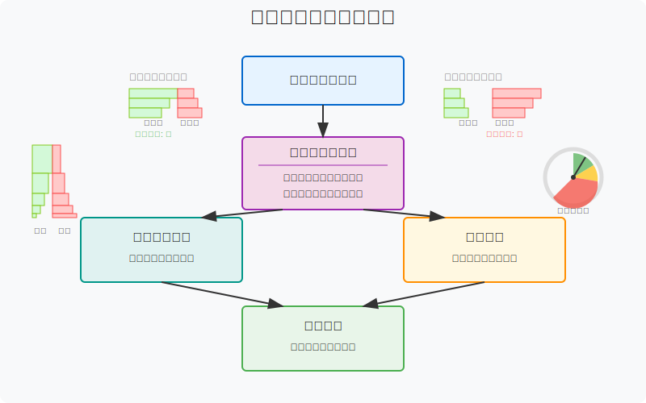
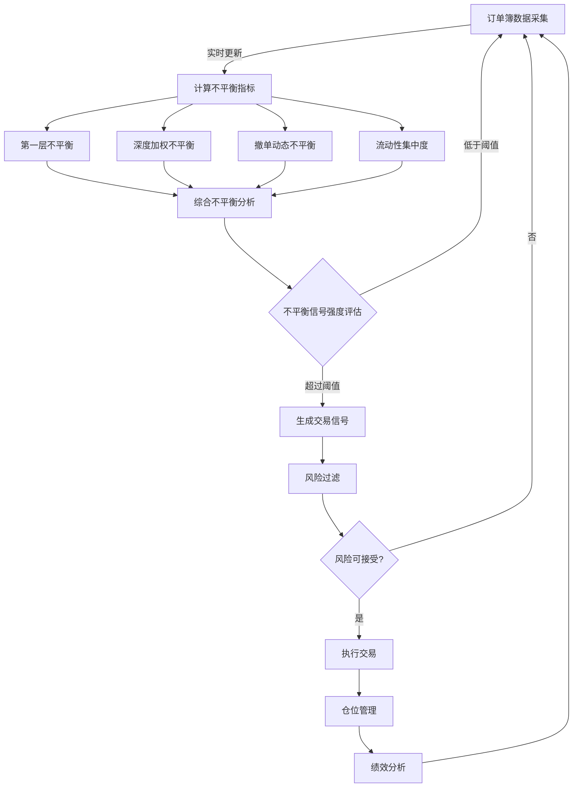
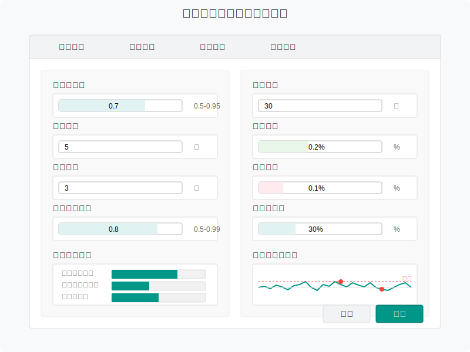
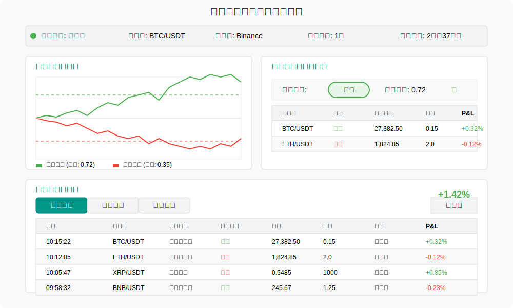
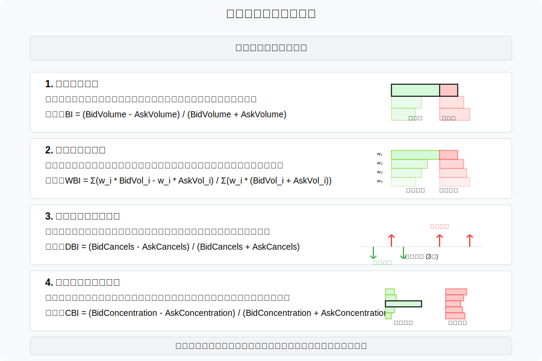

# 订单簿不平衡策略（Order Book Imbalance）原型设计

订单簿不平衡策略通过分析买卖双方挂单量的差异来预测短期价格走势，当出现显著不平衡时进行交易。本文档描述该策略的业务流程和界面原型。

## 策略概述

订单簿不平衡策略的核心理念是市场深度的不平衡反映了短期内的供需关系，当买单量远大于卖单量时，预示着上涨压力；反之则可能下跌。该策略特别适合短线交易和高频交易场景。



## 业务流程

订单簿不平衡策略的核心业务流程如下：



## 不平衡指标计算

订单簿不平衡策略使用多种指标来衡量买卖双方力量对比：

1. **第一层不平衡 (First Level Imbalance)**:
   ```
   FLI = BidVol₁ / (BidVol₁ + AskVol₁)
   ```
   其中，BidVol₁为买一量，AskVol₁为卖一量

2. **深度加权不平衡 (Depth Weighted Imbalance)**:
   ```
   DWI = ∑(BidVol_i × w_i) / [∑(BidVol_i × w_i) + ∑(AskVol_i × w_i)]
   ```
   其中，w_i为价格深度权重，通常随深度增加而递减

3. **动态不平衡 (Dynamic Imbalance)**:
   ```
   DI = (BidVol_t - BidVol_t-1) - (AskVol_t - AskVol_t-1)
   ```
   衡量一定时间窗口内买卖单量变化的差异

4. **流动性集中度 (Liquidity Concentration)**:
   ```
   LC = max(BidConcentration, AskConcentration)
   ```
   衡量订单簿中挂单量在某一价格区间的集中程度

## 策略参数配置界面



策略配置参数包括：

| 参数名称 | 描述 | 默认值 | 范围 |
|---------|------|------|------|
| 不平衡阈值 | 触发交易的最小不平衡值 | 0.7 | 0.5 - 0.95 |
| 监测深度 | 计算不平衡指标的订单簿深度 | 5档 | 1 - 20档 |
| 计算窗口 | 计算动态不平衡的时间窗口 | 3秒 | 0.5 - 30秒 |
| 价格深度权重 | 不同深度价格的权重衰减系数 | 0.8 | 0.5 - 0.99 |
| 持仓时间 | 最大持仓时间 | 30秒 | 1 - 300秒 |
| 止盈比例 | 目标获利比例 | 0.2% | 0.05% - 1% |
| 止损比例 | 止损比例 | 0.1% | 0.05% - 0.5% |
| 交易量比例 | 相对于流动性的交易量比例 | 30% | 5% - 80% |

## 监控面板原型



监控面板包含以下关键区域：

### 1. 不平衡指标实时显示
- 各层级不平衡值可视化
- 不平衡指标历史趋势
- 关键阈值标记线
- 指标相关性分析

### 2. 订单簿热图
- 买卖双方挂单量热图
- 不平衡区域高亮
- 大单撤单可视化
- 价格跳动标记

### 3. 信号强度面板
- 当前信号强度计量表
- 信号类型分布
- 信号触发频率统计
- 预测准确率反馈

### 4. 交易执行区
- 最近交易记录
- 当前持仓状态
- 盈亏实时统计
- 性能指标分析

## 信号类型与解读



订单簿不平衡策略识别的几种典型信号模式：

1. **强买入压力**
   - 买一挂单量远大于卖一挂单量(>3:1)
   - 多层买单深度持续增加
   - 卖单撤单率高
   - 价格在阻力位处有大量买单累积
   
2. **强卖出压力**
   - 卖一挂单量远大于买一挂单量(>3:1)
   - 多层卖单深度快速增加
   - 买单撤单率高
   - 价格在支撑位出现大量卖单
   
3. **中性但倾向性信号**
   - 买卖比例适中(1.5-3:1)
   - 深度加权不平衡有明显方向
   - 价格靠近关键水平位时出现不平衡
   - 大单突然出现在一侧

4. **震荡无明显方向**
   - 买卖双方力量接近平衡
   - 短时间内不平衡指标频繁变化方向
   - 买卖双方撤单行为频繁
   - 需观望不进行交易

## 策略优化功能

订单簿不平衡策略提供以下优化功能：

1. **自适应参数调整**
   - 根据市场波动率自动调整不平衡阈值
   - 基于历史表现优化价格深度权重
   - 调整计算窗口以适应不同市场条件
   
2. **多时间框架分析**
   - 结合不同时间周期的不平衡指标
   - 增强信号可靠性和持续性判断
   - 降低假信号率
   
3. **模式识别增强**
   - 识别特定的订单簿模式（如冰山订单、价格壁）
   - 关联历史相似模式的结果
   - 预测模式演变路径
   
4. **市场情绪整合**
   - 结合其他市场情绪指标
   - 调整不平衡阈值以适应不同市场环境
   - 避免极端市场条件下的错误信号

## 技术实现要点

订单簿不平衡策略的技术实现需要考虑：

1. **高频数据处理**
   - 订单簿数据的增量更新与重建
   - 微秒级不平衡指标计算
   - 时间序列数据的高效存储
   
2. **信号处理算法**
   - 噪音过滤技术
   - 多层级指标加权融合
   - 信号平滑处理
   
3. **机器学习增强**
   - 使用历史数据训练不平衡模型
   - 特征工程优化指标效果
   - 在线学习适应市场变化
   
4. **执行优化**
   - 智能订单路由
   - 最优执行时机判断
   - 订单拆分与聚合策略