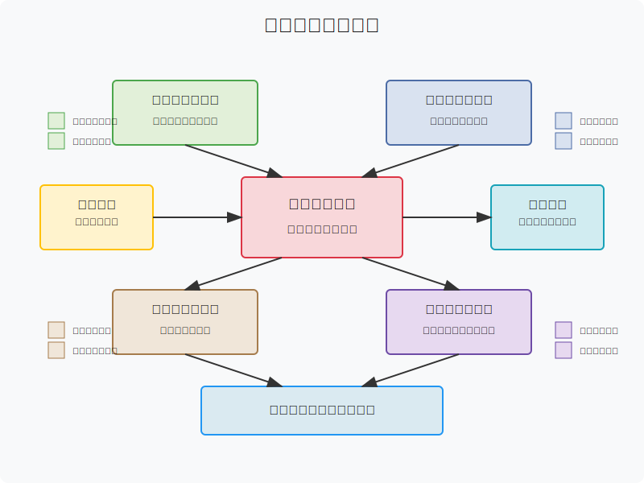
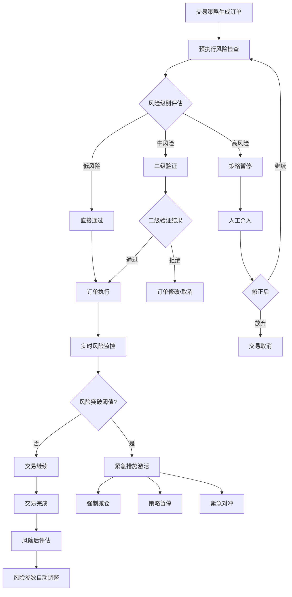
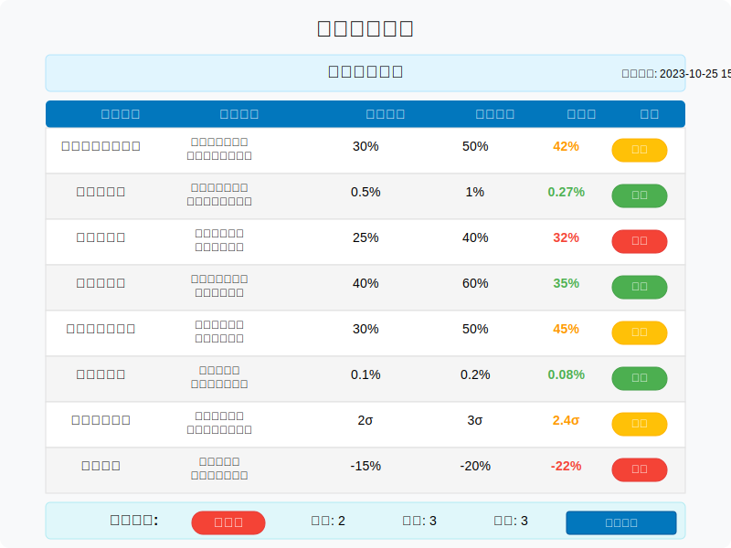
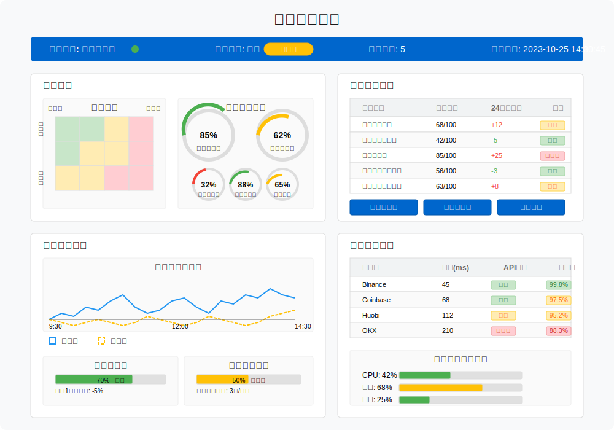
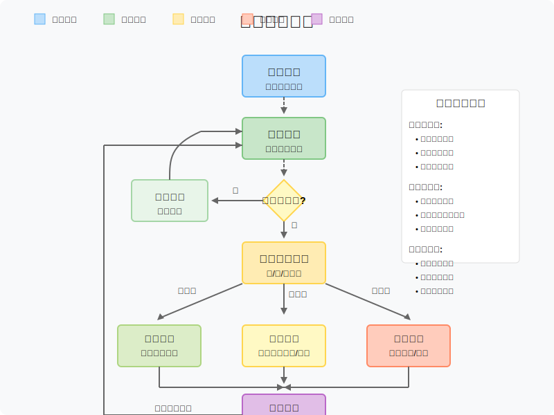
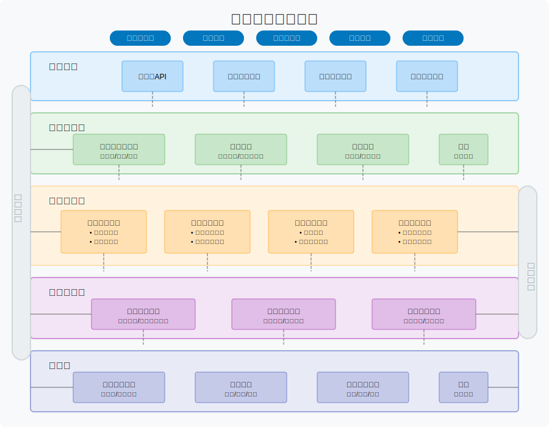

# 盘口策略风险管理模块原型设计

风险管理模块是所有盘口交易策略的核心保障系统，帮助交易者控制风险，优化交易执行，提高策略的长期稳定性。本文档描述风险管理模块的业务流程和界面原型。

## 整体架构

风险管理模块通过多层次风控机制，为不同类型的盘口策略提供全方位的风险防护，包括订单风险、流动性风险、交易对手风险和系统风险等方面。

## 核心风险管理流程

风险管理模块的核心业务流程如下：

## 风险控制层级

风险管理模块包含以下几个层级的风险控制：

### 1. 策略级风险控制
针对具体交易策略的风险管理，主要包括：
- 策略参数合理性检查
- 策略历史表现监控
- 策略互动影响分析
- 策略特定风险因子监控

### 2. 交易级风险控制
针对单笔交易的风险管理，主要包括：
- 订单大小与市场深度比较
- 订单价格偏离度检查
- 成交滑点预估与控制
- 部分成交风险管理

### 3. 账户级风险控制
针对整体账户的风险管理，主要包括：
- 总体仓位控制
- 资金利用率监控
- 保证金水平管理
- 账户风险敞口分析

### 4. 系统级风险控制
针对交易系统的风险管理，主要包括：
- 连接状态监控
- 延迟异常检测
- 系统负载管理
- 故障恢复机制

## 主要风险指标

风险管理模块监控的主要指标包括：

| 风险指标 | 描述 | 预警阈值 | 干预阈值 |
|---------|------|---------|---------|
| 单笔订单风险比率 | 订单量/对应档位流动性 | 30% | 50% |
| 价格偏离度 | 订单价格vs市场中间价偏离 | 0.5% | 1% |
| 净敞口比例 | 单向敞口/总资产 | 20% | 30% |
| 策略集中度 | 单一策略资金占比 | 40% | 60% |
| 耗尽流动性预警 | 策略可能消耗的流动性比例 | 40% | 70% |
| 滑点成本率 | 滑点成本/交易价值 | 0.1% | 0.2% |
| 交易频率异常 | 相对历史均值的标准差 | 2σ | 3σ |
| 胜率偏离 | 近期胜率vs历史胜率偏离 | -15% | -25% |

## 风险监控面板原型

风险监控面板包含以下关键区域：

### 1. 风险总览
- 全局风险热图
- 关键风险指标仪表盘
- 风险等级状态指示器
- 风险趋势变化图

### 2. 策略风险面板
- 各策略风险评分
- 策略相关性热图
- 策略风险贡献度
- 策略行为异常警报

### 3. 市场风险监测
- 市场波动率监测
- 流动性状况分析
- 价差异常检测
- 订单簿结构变化

### 4. 系统状态监控
- API连接状态
- 订单执行延迟
- 数据流畅通性
- 系统资源使用率

## 自动风险干预机制

风险管理模块具备多级自动干预机制：

1. **轻度干预**
   - 动态调整策略参数
   - 减小单笔订单规模
   - 扩大止损范围
   - 增加订单分批执行
   
2. **中度干预**
   - 暂停高风险策略
   - 主动减仓高风险头寸
   - 增加对冲头寸
   - 切换交易执行渠道
   
3. **重度干预**
   - 全面策略暂停
   - 快速平仓所有头寸
   - 转入灾难恢复模式
   - 触发人工审核流程

## 风险报告与分析工具

风险管理模块提供丰富的分析工具：

1. **实时风险分析**
   - 动态风险暴露计算
   - 即时VaR (Value at Risk) 评估
   - 压力测试模拟
   - 敏感性分析

2. **历史风险回顾**
   - 风险事件回放
   - 干预效果评估
   - 风险参数优化建议
   - 风险模式识别

3. **预测性风险分析**
   - 基于机器学习的风险预测
   - 情景模拟与评估
   - 潜在风险早期预警
   - 风险趋势预测

## 风险管理系统架构

风险管理系统的技术架构包括：

1. **实时数据处理层**
   - 高频订单流处理
   - 市场数据实时分析
   - 风险指标实时计算
   - 风险信号即时生成

2. **风险规则引擎**
   - 可配置风险规则系统
   - 规则优先级管理
   - 复合条件规则支持
   - 风险逻辑表达式处理

3. **决策执行层**
   - 自动干预执行
   - 紧急措施触发
   - 恢复流程管理
   - 人机协作接口

4. **历史数据分析层**
   - 风险数据仓库
   - 高级分析工具
   - 报告生成系统
   - 风险模型训练平台

## 与交易策略的集成

风险管理模块与各类盘口交易策略的集成方式：

1. **做市商策略集成**
   - 重点管理库存风险
   - 监控买卖双边平衡
   - 波动性异常保护
   - 价差收益风险评估

2. **流动性捕捉策略集成**
   - 信号可靠性验证
   - 避免假信号陷阱
   - 控制持仓时间风险
   - 监控市场冲击成本

3. **价差套利策略集成**
   - 执行延迟风险管理
   - 相关性突变监控
   - 流动性不对称风险
   - 监控套利窗口稳定性

4. **订单簿不平衡策略集成**
   - 信号强度验证
   - 突发性反转保护
   - 市场操纵识别
   - 信号衰减监控

5. **冰山订单探测策略集成**
   - 识别准确性验证
   - 防止过度追踪
   - 冰山消失风险管理
   - 大额订单保护 