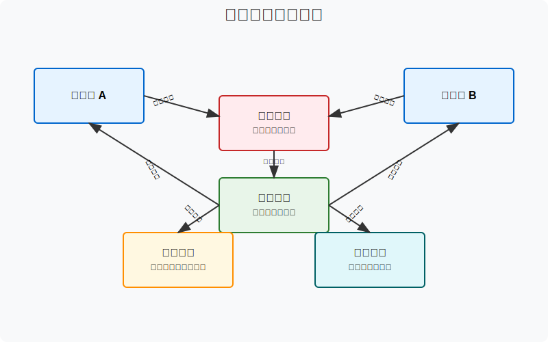
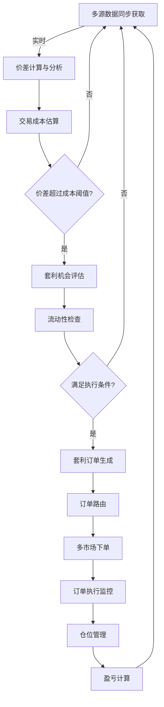
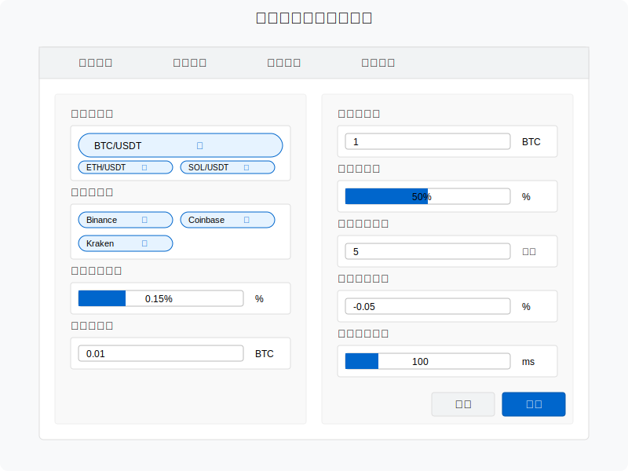
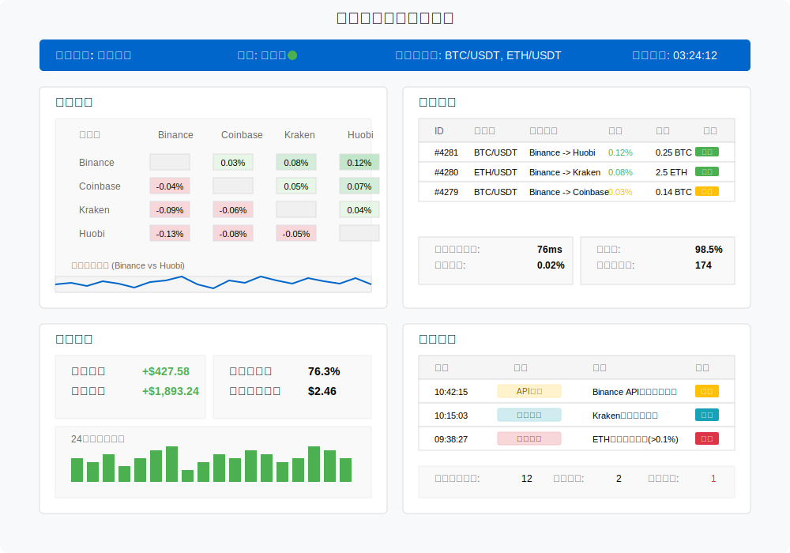
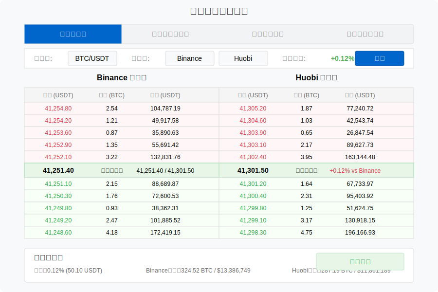

# 价差套利策略（Spread Arbitrage）原型设计

价差套利策略利用同一资产在不同交易所或不同合约间的价格差异进行套利交易。本文档描述该策略的业务流程和界面原型。

## 策略概述

价差套利策略通过监测和比较不同市场上的同一资产（或高度相关资产）的价格差异，当价差超过交易成本时，在低价市场买入并在高价市场卖出以获取无风险收益。

## 业务流程

价差套利策略的核心业务流程如下：

## 策略参数配置界面

策略配置参数包括：

| 参数名称 | 描述 | 默认值 | 范围 |
|---------|------|-------|------|
| 监控交易对 | 需监控的交易对列表 | BTC/USDT | 可多选 |
| 监控交易所 | 需监控的交易所列表 | Binance, Kraken, Coinbase | 可多选 |
| 最小价差阈值 | 触发套利的最小价差百分比 | 0.15% | 0.05% - 1% |
| 最小交易量 | 每笔交易的最小数量 | 0.01 BTC | 0.001 - 1 BTC |
| 最大交易量 | 每笔交易的最大数量 | 1 BTC | 0.01 - 10 BTC |
| 交易量比例 | 相对于可用流动性的交易量比例 | 50% | 10% - 90% |
| 最大持仓时间 | 未能完成套利的最大持仓时间 | 5分钟 | 1秒 - 1天 |
| 强制平仓价差 | 触发强制平仓的价差变化 | -0.05% | -1% - 0% |
| 最大延迟容忍 | 下单执行的最大延迟容忍 | 100ms | 10 - 1000ms |

## 监控面板原型

监控面板包含以下关键区域：

### 1. 价差矩阵
- 交易所间的价差热图
- 实时价差数值显示
- 历史价差趋势
- 可套利机会高亮

### 2. 执行监控
- 活跃套利订单状态
- 订单滑点监控
- 订单延迟统计
- 成交率分析

### 3. 盈亏统计
- 当日/累计盈亏
- 套利机会捕获率
- 平均每笔收益
- 成本结构分析

### 4. 警报区域
- 异常价差提醒
- 交易所连接状态
- API限制警告
- 套利风险提示

## 交易所流动性视图

流动性视图功能：

1. **多交易所订单簿对比**
   - 并排显示不同交易所订单簿
   - 可视化价格深度差异
   - 突出显示价差机会
   
2. **流动性滑点预估**
   - 预估不同交易量下的滑点
   - 最优交易量建议
   - 滑点风险警告
   
3. **市场冲击模拟**
   - 模拟交易对市场的影响
   - 交易分批执行建议
   - 冲击成本估算

## 风险管理功能

风险管理模块具备以下功能：

1. **交易延迟风险**
   - 交易延迟监控与预警
   - 自动调整延迟阈值
   - 延迟过高时暂停交易
   
2. **不完全执行风险**
   - 一边订单成交而另一边未成交的风险控制
   - 未配对头寸的紧急平仓
   - 部分成交的策略调整

3. **交易所风险**
   - 交易所API状态监控
   - 资金分配策略
   - 交易所切换机制

4. **市场风险**
   - 极端市场波动检测
   - 全市场同向流动性枯竭预警
   - 套利窗口消失保护

## 技术实现考虑

价差套利策略的技术实现需要关注：

1. **低延迟架构**
   - 交易所专线连接
   - 消息队列架构
   - 硬件加速（如FPGA）
   
2. **分布式执行**
   - 多服务器部署
   - 就近交易所部署
   - 任务分解与并行处理
   
3. **网络优化**
   - 多路由连接备份
   - 实时网络状态监测
   - 网络抖动自适应
   
4. **数据同步**
   - 时间戳精确对齐
   - 微秒级数据同步
   - 真实时延计算 